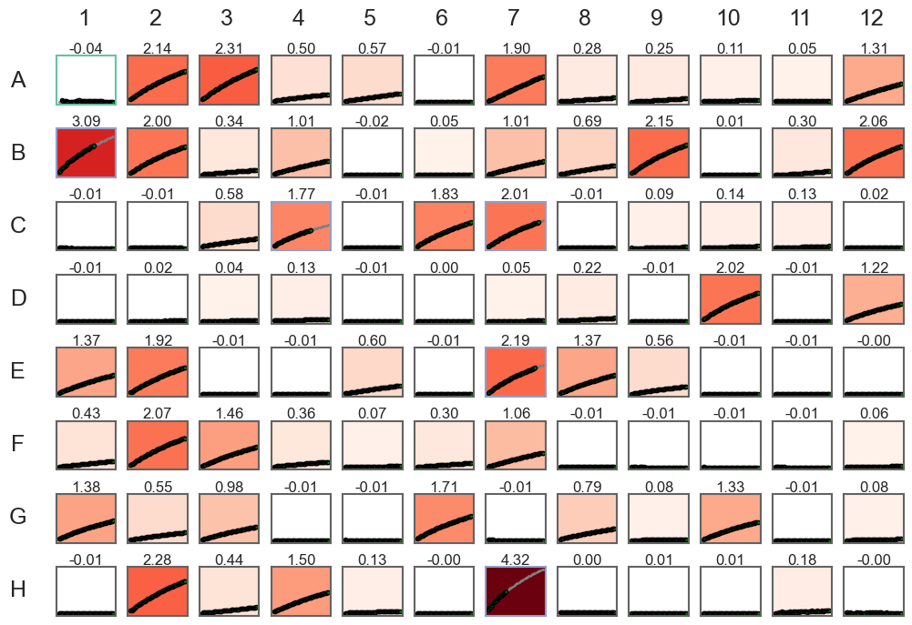
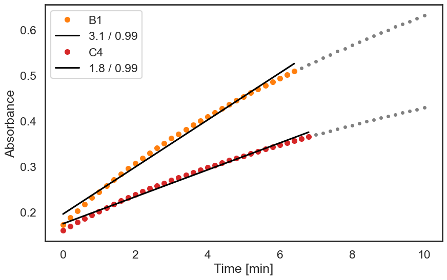

# 96well_auto
Automatic analysis of 96-well plate kinetic data

## Usage
This is a short programm to automate data extraction and fitting of 96-well plate kinetic measurements. The input file needs to be a tab-delimited sheet with the time points in the first column followed by the well data (see example_96well_data.txt). It'll automatically plot the data in 96-well format and extract slopes in the linear range. This behaviour can be addressed with the `--min_r2` and `--min_n` or `--full` parameters, setting the minimal r^2 threshold for extracting the linear range. All slopes are output to a text document by setting the `--output` flag.

```
usage: 96well_auto.py [-h] [-s [SINGLE [SINGLE ...]]] [--min_r2 MIN_R2] [--min_n MIN_N] [--break_thresh BREAK_THRESH] [--crop CROP CROP] [--full] [--negative] [-o] [-v] input_file

96-well plate screening kinetic analysis Author: Paul Zurek (pjz26@cam.ac.uk) v2.2a

positional arguments:
  input_file            96 well data. columns: Time (hh:mm:ss) followed by well data

optional arguments:
  -h, --help            show this help message and exit
  -s [SINGLE [SINGLE ...]], --single [SINGLE [SINGLE ...]]
                        Plot single wells (e.g. --single A4 G7)
  --min_r2 MIN_R2       Set min r2 for auto linear range
  --min_n MIN_N         Set min number of points for auto linear range
  --break_thresh BREAK_THRESH
                        Set threshold of break detection
  --crop CROP CROP      Crop by time (in minutes, e.g. --crop 0 5 to select first 5 minutes)
  --full                No slope adjustment, full data fitting
  --negative            Negative sloped assay
  -o, --output          flag to save slopes to file
  -v, --version         show program's version number and exit
  ```

## Example
Running the script with standard settings:  
```python 96well_auto.py example_96well_data.txt```




Plotting individual wells to verify linear range:  
```python 96well_auto.py example_96well_data.txt --single B1 C4```




Increasing the threshold for a better fit:  
```python 96well_auto.py example_96well_data.txt --single B1 C4 --min_r2 0.998```


